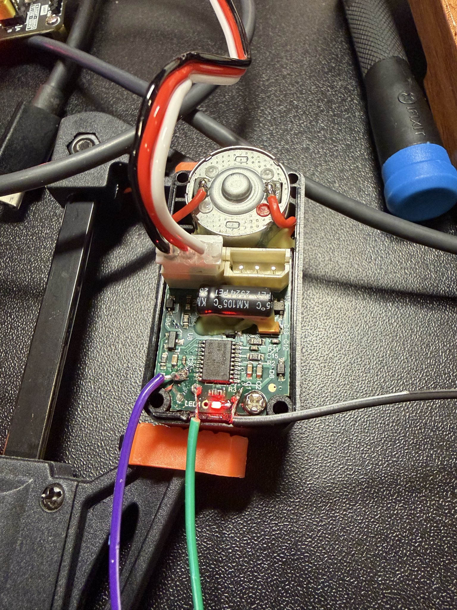

# Feetech firmware utility

This is my (very vibecoded) repo on downloading and decrypting the firmware.

This repo should have enough details to allow you to flash your own customized firmware on feetech servos without physically tampering with them.

## How?

Feetech firmware update packages are AES-256-ECB encrypted. The decrpytion happens on the device itself during update.

I was able to get SWD access by soldering to test points on the PCB and dump the SRAM, but had to explot a vulnerability on the MCU to bypass the readout protection — see [the analysis writeup](docs/bootloader-analysis.md).
Then I was able to get the encryption key from the bootloader. 

Readout-protection can be bypassed using the second vulnerability here [PT Swarm — Readout protection bypass on GigaDevice GD32 MCUs](https://swarm.ptsecurity.com/gigavulnerability-readout-protection-bypass-on-gigadevice-gd32-mcus/).

## How can I flash my own firmware?

See [the firmware update protocol doc](docs/firmware-update-protocol.md) — note that it is untested. AI generated reverse engineering notes on how the update utility updates the firmware. 
